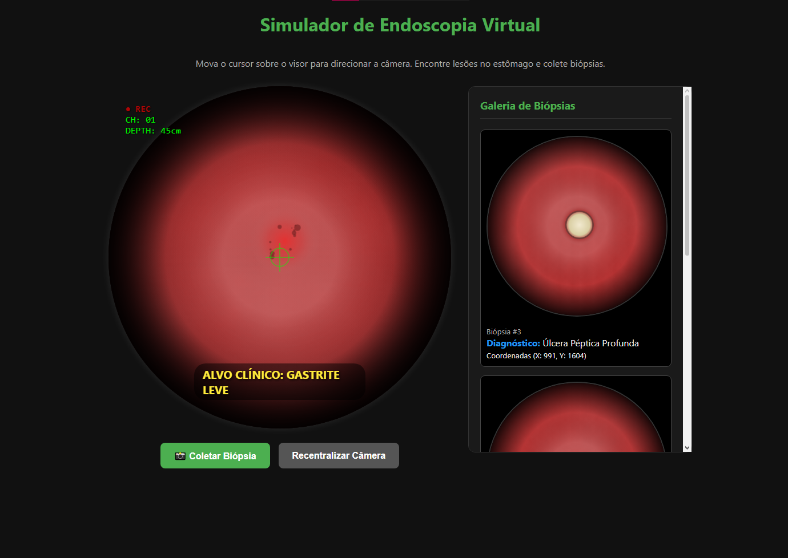
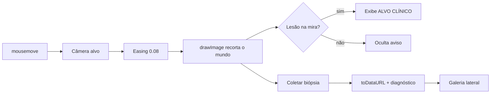

<div align="center">

# 🩺 Simulador de Endoscopia Virtual

**Navegue por um estômago virtual, encontre lesões e colete biópsias — tudo direto no navegador.**




*Visor do endoscópio com HUD, mira, alvo clínico detectado e galeria de biópsias.*

</div>

---

## 📑 Índice

- [Sobre o projeto](#-sobre-o-projeto)
- [Funcionalidades](#-funcionalidades)
- [Como usar](#-como-usar)
- [Lesões do mapa](#-lesões-do-mapa)
- [Tecnologias utilizadas](#-tecnologias-utilizadas)
- [Como funciona por dentro](#-como-funciona-por-dentro)
- [Instalação e execução](#-instalação-e-execução)
- [Estrutura de pastas](#-estrutura-de-pastas)
- [Personalização](#-personalização)
- [Limitações conhecidas](#-limitações-conhecidas)
- [Roadmap](#-roadmap)
- [Aviso legal](#-aviso-legal)
- [Contribuindo](#-contribuindo)
- [Licença](#-licença)
- [Autora](#-autora)

---

## 🎯 Sobre o projeto

O **Simulador de Endoscopia Virtual** é uma aplicação web educacional que reproduz, de forma simplificada, a experiência de uma endoscopia digestiva alta. O usuário controla a câmera com o mouse dentro de um "estômago virtual", procura por lesões e coleta biópsias, que aparecem numa galeria lateral com diagnóstico e coordenadas.

Todo o projeto vive em **um único arquivo `index.html`**, sem frameworks, sem build e sem backend.

**Para quem é:**

- 🎓 Estudantes de medicina e enfermagem que querem uma introdução visual ao tema
- 🧑‍💻 Desenvolvedores aprendendo a API Canvas 2D e renderização procedural
- 🙋 Curiosos que gostam de simulações interativas

---

## ✨ Funcionalidades

- 🔴 **Visor circular 600x600px** imitando a lente de um endoscópio, com vinheta escura e overlay
- 🗺️ **Mundo virtual de 2500x2500px** gerado proceduralmente em um canvas off-screen
- 🧬 **Mucosa realista**: cor base `#b34747` com 1500 gradientes radiais aleatórios simulando dobras e vasos
- 🎯 **5 lesões** espalhadas pelo mapa, com renderização própria para gastrites e úlceras
- 🖱️ **Câmera controlada pelo mouse** com movimento suave (easing) e limites para não sair do estômago
- 🎯 **Mira verde** centralizada no visor
- 📟 **HUD estilo câmera médica**: `● REC` piscando, `CH: 01` e `DEPTH: 45cm`
- 🏷️ **Detecção automática de lesão**: exibe `ALVO CLÍNICO: NOME DA LESÃO` quando a mira se aproxima
- 📸 **Coleta de biópsia** por botão ou clicando no visor
- 🖼️ **Galeria lateral** com captura do frame, número, diagnóstico e coordenadas (X, Y); itens recentes no topo
- 🔄 **Recentralizar câmera** com um clique
- 💡 **Efeitos de realismo**: luz central, bordas escurecidas e glitches aleatórios de flash (~1,5% dos frames)
- 🌙 **Tema escuro** e layout adaptável com `flex-wrap`

---

## 🕹️ Como usar

1. Abra o `index.html` no navegador.
2. **Mova o cursor** sobre o visor para direcionar a câmera pelo estômago.
3. Procure por áreas avermelhadas (gastrites) ou com centro claro e amarelado (úlceras).
4. Quando a mira ficar sobre uma lesão, o aviso amarelo **ALVO CLÍNICO** aparece na parte inferior do visor.
5. Clique em **📸 Coletar Biópsia** (ou clique diretamente no visor).
6. Confira na **Galeria de Biópsias** o frame capturado, o diagnóstico e as coordenadas.
7. Se se perder no mapa, use **Recentralizar Câmera**.

---

## 🩸 Lesões do mapa

| # | Nome | Tipo | Coordenadas (x, y) | Raio | Aparência visual |
|---|------|------|--------------------|------|------------------|
| 1 | Gastrite Erosiva | `gastritis` | (800, 700) | 80 | Área vermelha inflamada com pontos escuros de erosão |
| 2 | Gastrite Erosiva | `gastritis` | (1800, 900) | 100 | Área vermelha inflamada com pontos escuros de erosão |
| 3 | Úlcera Péptica Profunda | `ulcer` | (1000, 1600) | 70 | Centro amarelado (fibrina), borda vermelha e anel de sombra |
| 4 | Úlcera Péptica Profunda | `ulcer` | (1700, 1800) | 50 | Centro amarelado (fibrina), borda vermelha e anel de sombra |
| 5 | Gastrite Leve | `gastritis` | (1300, 1200) | 60 | Área vermelha inflamada com pontos escuros de erosão |

> A lesão 5 fica bem no centro do mapa, onde a câmera começa.

---

## 🛠️ Tecnologias utilizadas

| Tecnologia | Onde é usada |
|------------|--------------|
| **HTML5** | Estrutura da página, `<canvas>`, botões e galeria |
| **CSS3** | Tema escuro, flexbox, vinheta, mira e HUD via pseudo-elementos, animação `@keyframes` do `● REC` |
| **JavaScript (vanilla)** | Lógica da câmera, detecção de lesões, biópsias e galeria |
| **Canvas 2D API** | Geração da mucosa, renderização do visor, gradientes radiais e captura de frames |
| **requestAnimationFrame** | Loop principal de renderização |

---

## ⚙️ Como funciona por dentro

**1. Geração procedural da mucosa.** Ao carregar, um canvas off-screen de 2500x2500px é preenchido com a cor base e recebe 1500 gradientes radiais aleatórios. Em seguida, cada lesão é desenhada por cima conforme seu tipo.

**2. Câmera como janela de recorte.** O visor mostra apenas 600x600px do mundo. A cada frame, `drawImage` recorta a região centrada em `(camX, camY)`.

**3. Movimento com easing.** O mouse altera uma posição-alvo, e a câmera a persegue suavemente: `cam += (alvo - cam) * 0.08`.

**4. Detecção por distância.** Com `Math.hypot`, mede-se a distância entre o centro da câmera e cada lesão. Ela é detectada a menos de `raio + 60px`, e a biópsia a menos de `raio + 40px`.

**5. Captura da biópsia.** `canvas.toDataURL('image/png')` gera a imagem do frame atual, que vira um item da galeria.

**6. Efeitos de luz.** Um gradiente radial cria o centro brilhante e as bordas escuras, e flashes aleatórios simulam artefatos de câmera.



---

## 🚀 Instalação e execução

Não há `npm install`, build ou servidor obrigatório.

```bash
git clone https://github.com/luanagimns/simulador-endoscopia.git
cd simulador-endoscopia
```

**Opção 1 — Abrir direto:** dê dois cliques em `index.html`.

**Opção 2 — Live Server (VS Code):** instale a extensão *Live Server*, clique com o botão direito em `index.html` e escolha **Open with Live Server**.

**Opção 3 — Servidor Python:**

```bash
python -m http.server 8000
```

Depois acesse `http://localhost:8000`.

---

## 📁 Estrutura de pastas

```text
simulador-endoscopia/
├── docs/
│   └── screenshot.png
├── index.html
└── README.md
```

---

## 🎨 Personalização

Tudo está em `index.html`, dentro da tag `<script>`.

<details>
<summary><b>Alterar o tamanho do mundo</b></summary>

```js
const WORLD_W = 2500;
const WORLD_H = 2500;
```

</details>

<details>
<summary><b>Adicionar uma nova lesão</b></summary>

Inclua um objeto no array `lesions`. O `type` pode ser `gastritis` ou `ulcer`.

```js
const lesions = [
    // ...lesões existentes
    { x: 500, y: 2000, r: 90, name: "Gastrite Erosiva", type: "gastritis" }
];
```

</details>

<details>
<summary><b>Mudar a cor da mucosa</b></summary>

Em `generateMucosa()`:

```js
mCtx.fillStyle = '#b34747';
```

</details>

<details>
<summary><b>Ajustar a velocidade da câmera</b></summary>

Movimento por evento do mouse (em `mousemove`):

```js
targetCamX += nx * 20;
targetCamY += ny * 20;
```

Suavização (em `update()`; valores menores deixam a câmera mais lenta):

```js
camX += (targetCamX - camX) * 0.08;
camY += (targetCamY - camY) * 0.08;
```

</details>

<details>
<summary><b>Alterar a tolerância de detecção</b></summary>

```js
if (dist < l.r + 40) { /* biópsia */ }
if (dist < l.r + 60) { /* aviso de alvo clínico */ }
```

</details>

---

## ⚠️ Limitações conhecidas

- 🎲 A textura usa `Math.random`, então **o mapa muda a cada recarregamento** (as lesões ficam nas mesmas posições).
- 🎯 O diagnóstico usa o **centro da câmera**, e não a posição do cursor.
- 🩺 É uma simulação educacional, **sem validade clínica**.
- 💾 As biópsias **não persistem** ao recarregar a página.

---

## 🗺️ Roadmap

- [ ] Novos tipos de lesão
- [ ] Modo quiz
- [ ] Sistema de pontuação
- [ ] Exportar relatório em PDF
- [ ] Salvar biópsias no `localStorage`
- [ ] Suporte a touch/mobile
- [ ] Seed fixa para o mapa
- [ ] Modo claro/escuro

---

## ⚖️ Aviso legal

Este projeto é **exclusivamente educacional**. Ele não substitui formação médica e **não deve ser usado para diagnóstico** de nenhuma condição de saúde.

---

## 🤝 Contribuindo

1. Faça um **fork** do projeto
2. Crie uma branch: `git checkout -b minha-feature`
3. Faça o commit: `git commit -m "feat: minha feature"`
4. Envie: `git push origin minha-feature`
5. Abra um **Pull Request**

---

## 📄 Licença

Distribuído sob a licença **MIT**. Veja o arquivo [LICENSE](LICENSE).

---

## 👩‍💻 Autora

**Luana** — GitHub: [@luanagimns](https://github.com/luanagimns)

- 💼 LinkedIn: [linkedin.com/in/luanagimns](https://www.linkedin.com/in/luanagimns/)
- ✉️ E-mail: luanagimenes09@gmail.com

---

<div align="center">

Se este projeto foi útil, deixe uma ⭐ no repositório!

**Feito com 💚 e JavaScript puro**

</div>
